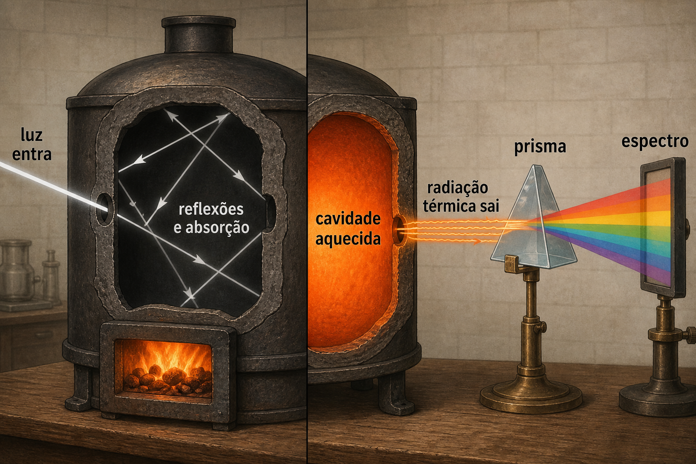
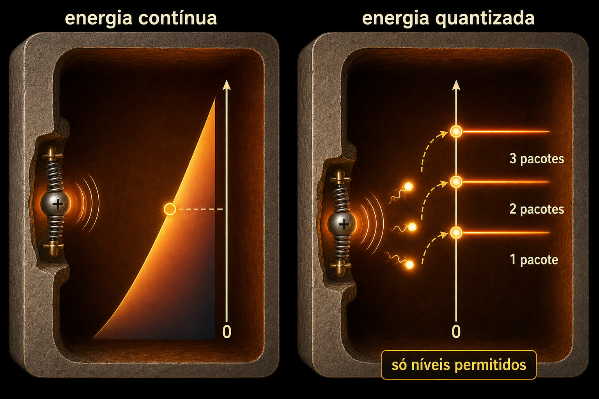
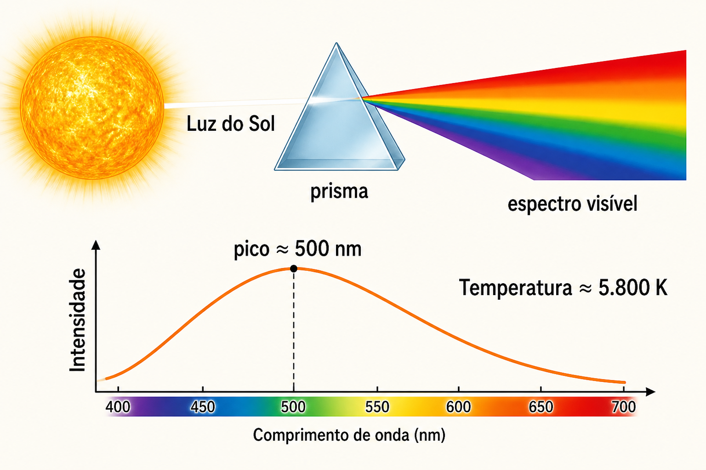
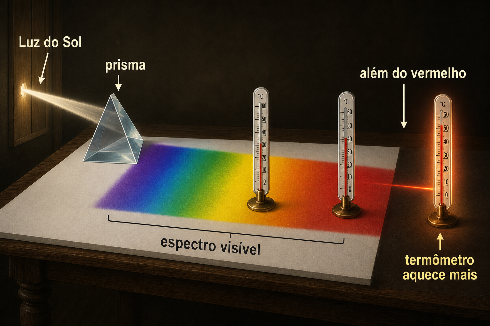
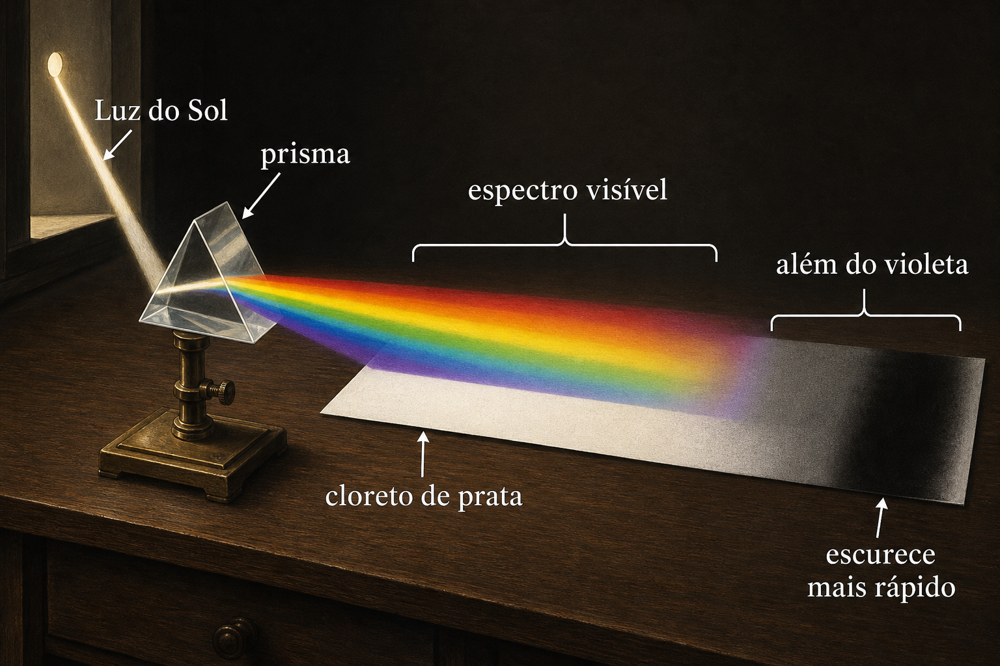

# Introdução à computação quântica: da radiação térmica aos qubits

## Objetivos da aula

Ao final deste material, o estudante deverá ser capaz de:

- explicar por que alguns experimentos não podiam ser compreendidos pela física clássica;
- distinguir energia contínua de energia quantizada;
- relacionar fótons, ondas de matéria e função de onda;
- interpretar a dupla fenda como uma demonstração de superposição e interferência;
- reconhecer como essas ideias reaparecem no funcionamento de um qubit.

> **Ideia orientadora:** a computação quântica não surgiu diretamente da informática. Ela nasceu de uma longa tentativa de compreender como luz e matéria se comportam em escala microscópica.

---

## 1. O problema da radiação do corpo negro

Um **corpo negro** é um modelo ideal de objeto que absorve toda a radiação que recebe. A melhor realização experimental é uma cavidade aquecida com um pequeno orifício. A radiação que escapa pelo orifício representa muito bem a radiação térmica existente no interior.

Na montagem histórica, a cavidade era aquecida, a radiação saía pelo pequeno orifício e um prisma ou uma rede de difração separava essa radiação por comprimento de onda. Um detector media a intensidade em cada região do espectro.

Todas as faixas de comprimento de onda são emitidas simultaneamente. Quando a temperatura aumenta:

- a intensidade total cresce;
- o pico do espectro se desloca para comprimentos de onda menores;
- o objeto passa de praticamente invisível para vermelho, alaranjado e, em temperaturas maiores, branco.

Isso não significa que o objeto emita uma única cor. Ele emite um espectro contínuo, mas algumas regiões são mais intensas que outras.

### Atividade interativa

[Abrir o simulador do corpo negro](../../assets/simuladores/simulador-corpo-negro.html)

Experimente alterar a temperatura e observe:

1. Como muda a intensidade total?
2. Para que lado o pico se desloca?
3. Em temperaturas baixas, em qual região está a maior parte da radiação?

### A dificuldade clássica

A física clássica previa que a cavidade deveria emitir energia cada vez maior em frequências muito altas. Essa previsão, chamada posteriormente de **catástrofe do ultravioleta**, não correspondia aos resultados experimentais.

---

## 2. Planck e a quantização da energia

Em 1900, Max Planck propôs que as oscilações nas paredes da cavidade não poderiam trocar qualquer quantidade de energia. A energia seria absorvida ou emitida em pacotes:

$$
E = n h f, \qquad n=0,1,2,3,\ldots
$$

Nessa expressão:

- $E$ é a energia permitida;
- $n$ é um número inteiro;
- $h$ é a constante de Planck;
- $f$ é a frequência da radiação.

A analogia mais simples é a diferença entre uma rampa e uma escada. Na descrição clássica, qualquer valor intermediário seria possível. Na quantização, somente determinados degraus são permitidos.

> Em deep learning, “quantização” é uma aproximação de engenharia que representa números usando menos níveis. Na física quântica, os níveis discretos são uma característica do próprio sistema físico.

---

## 3. Como o espectro revela a temperatura

O prisma não mede diretamente a temperatura da luz. Ele separa a radiação em diferentes comprimentos de onda. Medindo a intensidade de cada faixa, construímos a curva espectral.

Para um corpo negro, a lei de Wien relaciona o comprimento de onda do pico à temperatura:

$$
\lambda_{\max}T=b,
$$

em que $b\approx 2{,}898\times10^{-3}\ \text{m·K}$.

O espectro solar se aproxima do espectro de um corpo negro com temperatura efetiva de aproximadamente $5.800\ \text{K}$, ou cerca de $5.500\ ^\circ\text{C}$ na fotosfera.

As linhas escuras presentes no espectro solar são linhas de absorção. Elas ajudam a identificar os elementos químicos presentes; a forma geral da curva é que fornece a estimativa de temperatura.

---

## 4. Radiações invisíveis: infravermelho e ultravioleta

### Infravermelho

Em 1800, William Herschel separou a luz solar com um prisma e colocou termômetros em diferentes regiões do espectro. Um termômetro posicionado além do vermelho, onde o olho não via luz, também aqueceu. Herschel detectou energia invisível: o **infravermelho**.

O termômetro não media a “temperatura da cor”. Ele funcionava como detector da energia absorvida.

### Ultravioleta

Em 1801, Johann Wilhelm Ritter usou cloreto de prata, uma substância que escurece sob a ação da luz. A reação foi ainda mais intensa além do violeta, revelando a radiação que hoje chamamos de **ultravioleta**.

---

## 5. O efeito fotoelétrico e os fótons

No efeito fotoelétrico, luz incide sobre um metal e pode ejetar elétrons. Os resultados mostraram que:

- abaixo de uma frequência mínima, nenhum elétron é ejetado, mesmo aumentando muito a intensidade;
- acima dessa frequência, a emissão ocorre sem atraso perceptível;
- aumentar a frequência aumenta a energia cinética máxima dos elétrons;
- aumentar a intensidade, quando a frequência já é suficiente, aumenta principalmente a quantidade de elétrons emitidos.

Einstein explicou o fenômeno em 1905 tratando a luz como pacotes de energia, posteriormente chamados **fótons**:

$$
E_{\text{fóton}}=hf.
$$

Para retirar um elétron do metal, o fóton precisa fornecer pelo menos a função trabalho $\Phi$:

$$
K_{\max}=hf-\Phi.
$$

Uma luz mais intensa possui mais fótons. Porém, se cada fóton tiver energia insuficiente, aumentar sua quantidade não resolve o problema.

---

## 6. Bohr e os níveis de energia do átomo

Em 1913, Niels Bohr propôs que o elétron no átomo só poderia ocupar certos níveis de energia. Ao passar de um nível mais alto para outro mais baixo, o átomo emitiria um fóton:

$$
hf=E_i-E_f.
$$

O modelo de Bohr foi uma etapa histórica decisiva, embora as “órbitas” não sejam a descrição aceita pela mecânica quântica moderna. Hoje descrevemos o elétron por estados e orbitais, e não como um pequeno planeta em trajetória definida.

---

## 7. De Broglie: matéria também se comporta como onda

Em 1924, Louis de Broglie propôs que uma partícula com momento $p$ possui um comprimento de onda associado:

$$
\lambda=\frac{h}{p}.
$$

Essa ideia ajuda a compreender por que apenas certos estados são permitidos: os padrões ondulatórios precisam satisfazer condições específicas. Pouco depois, experimentos de difração de elétrons confirmaram o comportamento ondulatório da matéria.

---

## 8. Função de onda e probabilidade

A função de onda, representada por $\psi$, descreve o estado quântico. Ela não é uma trajetória nem uma onda material comum. Em uma descrição simplificada, o quadrado de seu módulo fornece a densidade de probabilidade:

$$
P(x)=|\psi(x)|^2.
$$

Antes da medição, a função de onda pode estar distribuída por várias possibilidades. Na detecção, porém, encontramos o elétron inteiro em um ponto. Ao repetir o experimento muitas vezes, os impactos formam a distribuição prevista por $|\psi|^2$.

---

## 9. A dupla fenda: superposição e interferência

Na dupla fenda, podemos representar a amplitude total como a soma das amplitudes associadas às duas alternativas:

$$
\psi=\psi_1+\psi_2.
$$

A probabilidade de detecção é:

$$
P=|\psi_1+\psi_2|^2.
$$

Esse resultado contém um termo de interferência. Em algumas posições, as amplitudes se reforçam; em outras, cancelam-se. Mesmo enviando elétrons individualmente, os impactos pontuais acumulam gradualmente um padrão de franjas.

### Atividade interativa 3D

[Abrir o simulador da dupla fenda com elétrons](../../assets/simuladores/simulador-fenda-dupla-eletrons-v4.html)

No simulador, o movimento é uma representação didática:

- o canhão emite um elétron por vez;
- antes da detecção, mostramos um pacote de onda;
- após a barreira, duas amplitudes representam as alternativas associadas às fendas;
- o anteparo registra apenas um impacto pontual por elétron;
- muitos impactos revelam o padrão de interferência.

O controle **Velocidade da animação** altera apenas o ritmo visual. Não representa diretamente a velocidade física do elétron e não modifica o padrão calculado.

> **Cuidado conceitual:** não devemos imaginar uma bolinha clássica dividindo-se em duas metades. O que se superpõe são amplitudes quânticas; a detecção registra um elétron inteiro.

---

## 10. Da dupla fenda ao qubit

Um bit clássico assume $0$ ou $1$. Um qubit pode estar em uma superposição:

$$
|\psi\rangle=\alpha|0\rangle+\beta|1\rangle,
$$

com

$$
|\alpha|^2+|\beta|^2=1.
$$

Ao medir o qubit:

- obtemos $0$ com probabilidade $|\alpha|^2$;
- obtemos $1$ com probabilidade $|\beta|^2$.

A relação com a dupla fenda é estrutural:

| Dupla fenda | Qubit |
|---|---|
| Alternativa pela fenda 1 | Estado $|0\rangle$ |
| Alternativa pela fenda 2 | Estado $|1\rangle$ |
| Soma de amplitudes | Superposição |
| Diferença de fase entre caminhos | Fase relativa do qubit |
| Franjas de interferência | Interferência produzida por portas quânticas |
| Impacto pontual no anteparo | Resultado clássico da medição |

Dentro de um computador quântico normalmente não existe uma dupla fenda física. As alternativas são estados do qubit. As **portas quânticas** controlam amplitudes e fases para produzir interferência: caminhos associados a respostas desejadas podem ser reforçados e outros podem ser reduzidos.

### Exemplo mínimo: porta Hadamard

Se o qubit começa em $|0\rangle$, a porta Hadamard cria a superposição:

$$
H|0\rangle=\frac{|0\rangle+|1\rangle}{\sqrt{2}}.
$$

Aplicando a mesma porta novamente:

$$
H\left(\frac{|0\rangle+|1\rangle}{\sqrt{2}}\right)=|0\rangle.
$$

As amplitudes não foram apenas “sorteadas”: elas interferiram. Essa possibilidade de manipular interferência é uma das principais fontes do poder dos algoritmos quânticos.

---

## 11. Sequência sugerida para apresentação

1. Apresente a cavidade de corpo negro e deixe a turma explorar a temperatura.
2. Mostre por que a previsão clássica falhava.
3. Introduza os pacotes de Planck e a analogia da escada.
4. Use o efeito fotoelétrico para transformar a quantização em uma explicação física da luz.
5. Passe aos níveis de Bohr e à hipótese de de Broglie.
6. Apresente $|\psi|^2$ como mapa de probabilidades.
7. Explore a dupla fenda no simulador, primeiro lentamente e depois acumulando impactos.
8. Faça a correspondência entre duas fendas, duas amplitudes e os estados $|0\rangle$ e $|1\rangle$.
9. Termine com a porta Hadamard como primeiro exemplo de interferência controlada.

---

## 12. Perguntas para discussão

1. Por que aumentar a intensidade de uma luz vermelha pode não produzir efeito fotoelétrico?
2. Qual é a diferença entre a função de onda e a probabilidade de detecção?
3. Se cada elétron produz apenas um ponto, como surge um padrão de interferência?
4. O controle de velocidade do simulador muda a física ou apenas a visualização?
5. Em que sentido um qubit se parece com a dupla fenda?
6. Por que dizer que o qubit é “zero e um ao mesmo tempo” é útil, mas incompleto?

## 13. Exercício de consolidação

Peça aos estudantes que completem a frase:

> “Na dupla fenda, as amplitudes associadas aos caminhos interferem antes da medição. Em um computador quântico, as amplitudes associadas aos estados __________ interferem por meio de __________, e a medição produz __________.”

Resposta esperada: **$|0\rangle$ e $|1\rangle$; portas quânticas; um resultado clássico**.

---

## Resumo

A trajetória conceitual desta aula é:

**radiação térmica → quantização → fótons → níveis de energia → ondas de matéria → função de onda → superposição → interferência → qubits.**

O elemento unificador é a amplitude quântica. Ela pode ser combinada, adquirir fase e interferir. A computação quântica transforma esse comportamento, observado inicialmente em experimentos fundamentais, em uma ferramenta controlável para processar informação.
