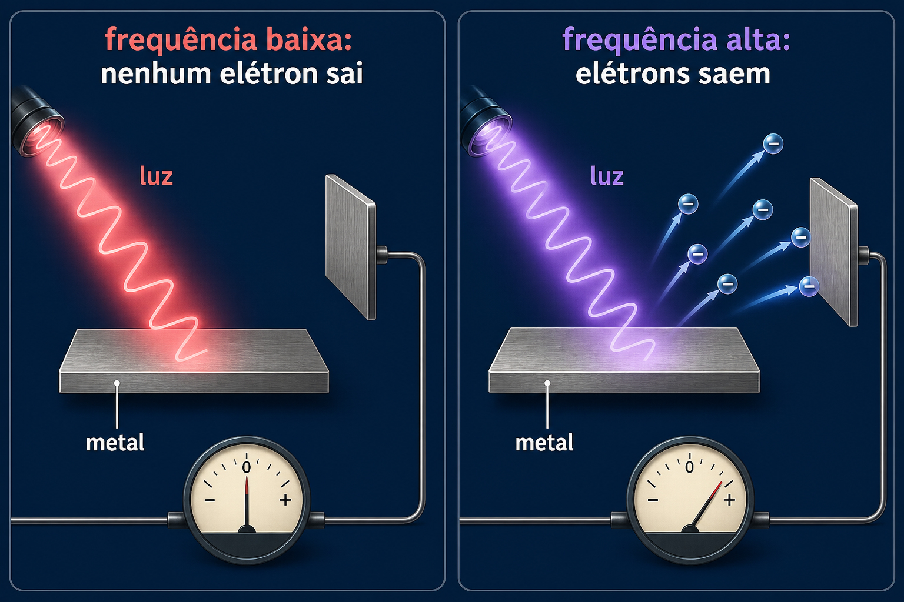

# Módulo 3 — Efeito fotoelétrico e fótons

## Experimento

Luz incide sobre uma superfície metálica. Quando a frequência é suficiente, elétrons são ejetados e podem ser coletados por um circuito. Hallwachs usou uma placa de zinco e luz ultravioleta; outros metais, como sódio e césio, respondem a frequências menores.

Os resultados fundamentais são:

- existe uma frequência mínima para cada material;
- abaixo dela, aumentar a intensidade não ejeta elétrons;
- acima dela, maior frequência produz elétrons com maior energia cinética;
- maior intensidade significa principalmente mais elétrons emitidos.

Einstein explicou o fenômeno atribuindo à luz pacotes de energia:

$$E_{\text{fóton}}=hf,$$

$$K_{\max}=hf-\Phi,$$

onde $\Phi$ é a energia mínima necessária para liberar o elétron.

## Relação com a computação quântica

O experimento mostra que interações quânticas individuais produzem eventos discretos. Computadores quânticos também terminam em medições discretas: cada execução devolve bits clássicos, embora o estado anterior seja descrito por amplitudes. Detectores de fótons e interfaces luz-matéria também são componentes importantes da computação e comunicação quânticas fotônicas.

## Cuidado conceitual

Um elétron não sai necessariamente numa única direção fixa. A direção depende do material, da luz e das colisões internas; o aparelho coleta uma distribuição de elétrons.

