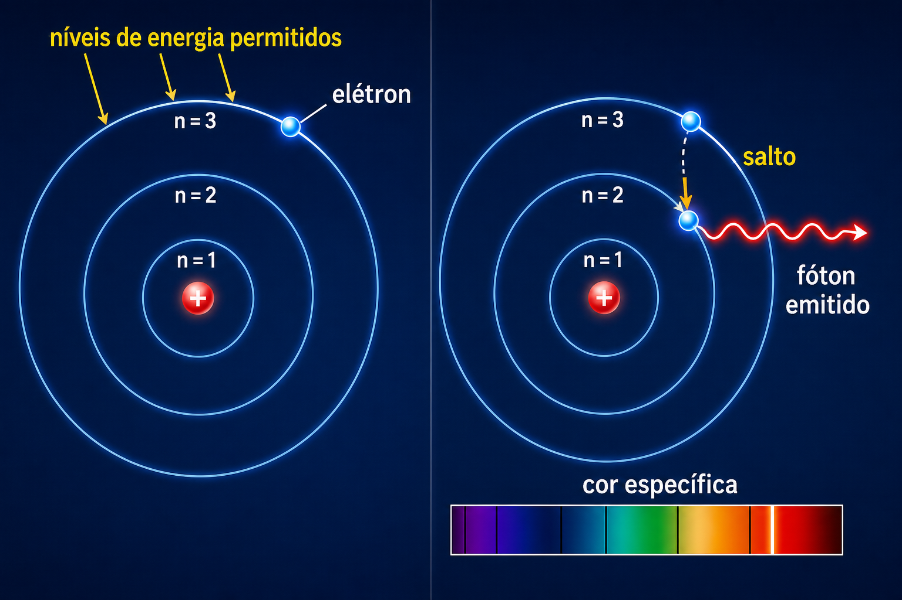

# Módulo 4 — Bohr e níveis de energia

Bohr propôs, em 1913, que o elétron só poderia ocupar determinados níveis de energia. Uma transição entre níveis envolve emissão ou absorção de um fóton:

$$hf=|E_f-E_i|.$$

Isso explicou por que átomos emitem linhas espectrais específicas, em vez de todas as cores possíveis.

## Limite do modelo

A imagem de órbitas circulares é uma etapa histórica, não a descrição moderna. Na mecânica quântica, elétrons são descritos por estados e orbitais, não por trajetórias planetárias definidas.

## Relação com a computação quântica

Um qubit escolhe dois estados distinguíveis de um sistema quântico e os chama de $|0\rangle$ e $|1\rangle$. Pulsos com frequência ressonante à diferença de energia permitem controlar transições. O desafio prático é preservar esses estados contra ruído e evitar transições indesejadas para outros níveis.

## Pergunta de verificação

Por que um átomo produz linhas de cores específicas em vez de um arco-íris contínuo?

