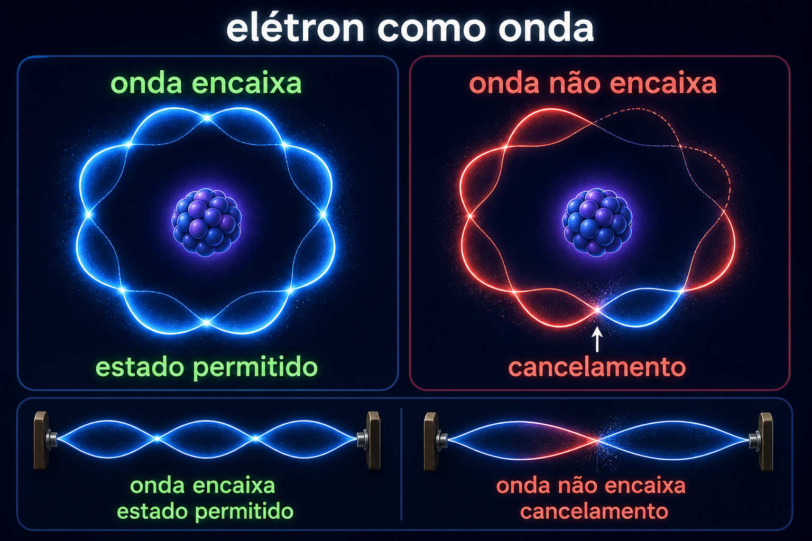

# Módulo 5 — De Broglie e ondas de matéria

De Broglie propôs que uma partícula com momento $p$ possui comprimento de onda:

$$\lambda=\frac{h}{p}.$$

Padrões ondulatórios permitidos precisam satisfazer condições de contorno, de modo semelhante a uma onda estacionária numa corda. Experimentos posteriores de difração de elétrons confirmaram que matéria pode produzir interferência.

## O que é difração?

É o espalhamento característico de uma onda ao atravessar aberturas ou contornar estruturas. Regiões de reforço e cancelamento formam um padrão que partículas clássicas, seguindo apenas trajetórias definidas, não produziriam.

## Relação com a computação quântica

Qubits não são bolinhas clássicas. Seus estados têm amplitudes e fases, propriedades matemáticas ondulatórias. A computação quântica usa precisamente a possibilidade de controlar essas fases e fazer amplitudes interferirem.

## Atividade

Compare uma órbita clássica, uma onda que fecha sobre si mesma e outra que não fecha. Discuta por que a quantização pode surgir das condições impostas à onda.

