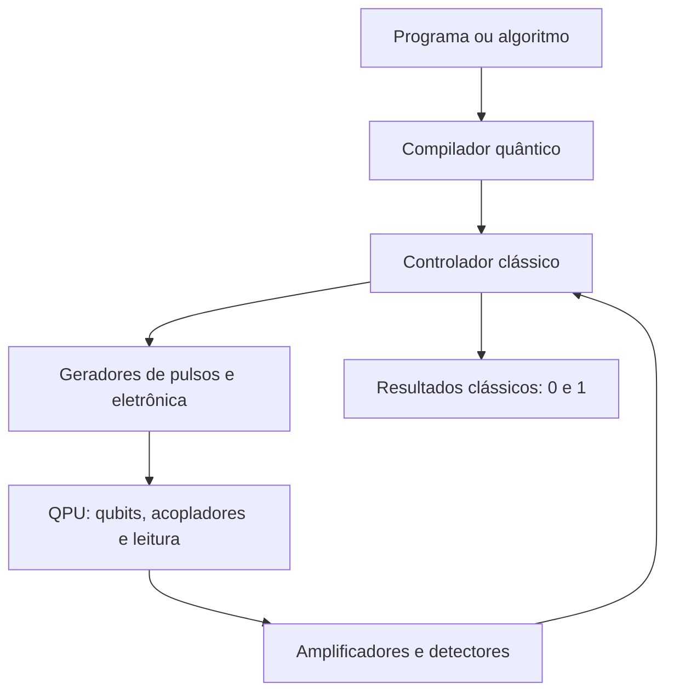

# Módulo 10 — Como funciona um processador quântico

## Objetivos

Ao final deste módulo, o estudante deverá ser capaz de:

- distinguir qubit físico, qubit lógico e processador quântico;
- identificar as camadas de um computador quântico;
- explicar do que são feitos os principais tipos de qubit;
- compreender como os qubits são inicializados, controlados e medidos;
- explicar por que temperatura, ruído e materiais afetam o processamento.

## 1. O que é um processador quântico?

O **processador quântico**, ou QPU (*Quantum Processing Unit*), é a parte do computador que contém os qubits físicos e realiza operações quânticas. Ele não é, sozinho, o computador inteiro. Precisa trabalhar com equipamentos clássicos de controle, geração de sinais, refrigeração ou vácuo, leitura e correção de erros.

Não existe um único material chamado “material quântico” usado em todas as máquinas. Um qubit pode ser construído com circuitos supercondutores, átomos carregados, átomos neutros, fótons, elétrons confinados em semicondutores ou defeitos controlados em cristais. Qualquer sistema adequado precisa possuir estados quânticos distinguíveis e controláveis.

## 2. As camadas de um computador quântico

### Programa e compilador

O programador descreve um circuito com portas quânticas. O compilador adapta essas portas ao conjunto de operações realmente disponível no hardware, escolhe qubits físicos e tenta reduzir erros e deslocamentos desnecessários de informação.

### Controlador clássico

Um computador convencional coordena a experiência. Ele transforma cada porta do circuito em pulsos elétricos, micro-ondas ou laser com duração, frequência, amplitude e fase cuidadosamente calibradas.

### QPU

A QPU contém:

- **qubits físicos**, que armazenam amplitudes quânticas;
- **acopladores** ou interações controladas, usados em portas de dois qubits;
- **estruturas de leitura**, que convertem o estado quântico em um sinal mensurável;
- **conexões**, ressonadores, eletrodos ou guias que levam os sinais até os qubits.

### Ambiente de operação

O processador precisa ser isolado do ambiente. Dependendo da tecnologia, isso exige temperaturas próximas do zero absoluto, câmaras de ultra-alto vácuo, blindagem eletromagnética, lasers estabilizados ou combinações desses recursos.

### Leitura e pós-processamento

Ao final, os qubits são medidos. Cada execução, ou *shot*, produz bits clássicos. O circuito é repetido muitas vezes para estimar as probabilidades dos possíveis resultados.

## 3. Exemplo principal: processador com qubits supercondutores

É útil começar pelos circuitos supercondutores porque eles se parecem visualmente com chips eletrônicos, embora funcionem por princípios diferentes dos transistores de um processador clássico.

### Do que ele é feito?

Um chip supercondutor pode usar:

- um substrato de **silício** ou **safira**;
- filmes e trilhas supercondutoras, frequentemente de **alumínio**, **nióbio** ou **nitreto de titânio**;
- capacitores, ressonadores e interconexões definidos por microfabricação;
- **junções Josephson**, formadas por dois eletrodos supercondutores separados por uma barreira isolante extremamente fina;
- estruturas de acoplamento e ressonadores de leitura;
- contatos e encapsulamento que conectam o chip à eletrônica externa.

Uma realização comum de junção Josephson utiliza alumínio, uma camada muito fina de óxido de alumínio e outro eletrodo de alumínio. Pares de elétrons do estado supercondutor podem atravessar a barreira por tunelamento quântico.

### Por que a junção Josephson é importante?

Um circuito formado apenas por um capacitor e um indutor seria um oscilador com níveis igualmente espaçados. Nesse caso, seria difícil controlar somente os dois primeiros níveis sem excitar os demais.

A junção Josephson age como um elemento indutivo **não linear**. Ela torna os intervalos entre níveis diferentes. Assim, dois níveis podem ser selecionados para representar:

$$|0\rangle \quad \text{e} \quad |1\rangle.$$

Esses dois estados não correspondem simplesmente a “corrente desligada” e “corrente ligada”. São estados quânticos coletivos de um circuito elétrico supercondutor.

### Propriedades físicas

- **Supercondutividade:** abaixo de uma temperatura crítica, a resistência elétrica do material desaparece e os elétrons formam pares de Cooper.
- **Energia quantizada:** o circuito possui níveis discretos.
- **Anarmonicidade:** os níveis não ficam igualmente espaçados, permitindo selecionar os dois usados pelo qubit.
- **Coerência:** o estado preserva fase e superposição por um tempo limitado.
- **Acoplamento controlável:** qubits vizinhos podem interagir para produzir emaranhamento.
- **Sensibilidade:** defeitos nos materiais, radiação, calor e ruído elétrico causam decoerência.

### Por que ele fica tão frio?

O chip costuma operar dentro de um refrigerador de diluição, em temperaturas da ordem de milikelvin, próximas do zero absoluto. O resfriamento:

- mantém os materiais no regime supercondutor;
- reduz excitações térmicas que poderiam tirar o qubit de $|0\rangle$;
- diminui certas fontes de ruído.

O processador fica no estágio mais frio, enquanto cabos, filtros e amplificadores ocupam diferentes estágios térmicos. A estrutura metálica semelhante a um lustre é o sistema de refrigeração e conexão; o chip quântico é apenas uma pequena parte localizada em sua região inferior.

## 4. Como uma operação é realizada

Considere um qubit supercondutor:

1. **Inicialização:** espera-se o sistema relaxar para o estado de menor energia, $|0\rangle$, ou aplica-se uma inicialização ativa.
2. **Pulso de controle:** um sinal de micro-ondas ressonante com a transição do qubit é enviado por uma linha de controle.
3. **Rotação:** duração, amplitude e fase do pulso determinam como o estado gira na esfera de Bloch.
4. **Porta de dois qubits:** ativa-se ou explora-se o acoplamento entre dois qubits para correlacioná-los e gerar emaranhamento.
5. **Leitura:** o qubit altera ligeiramente a resposta de um ressonador de micro-ondas.
6. **Amplificação:** o sinal muito fraco atravessa amplificadores criogênicos e eletrônica de aquisição.
7. **Classificação:** o controlador clássico converte o sinal em resultado $0$ ou $1$.

Uma porta Hadamard não é uma peça que se abre e fecha dentro do chip. Ela é implementada por uma sequência calibrada de pulsos que produz a transformação matemática desejada.

## 5. Outras tecnologias de processadores quânticos

### Íons aprisionados

**Do que são feitos:** átomos ionizados, como itérbio, cálcio ou bário, mantidos suspensos por campos eletromagnéticos numa câmara de vácuo. Eletrodos microfabricados formam a armadilha.

**Como funcionam:** dois níveis internos do íon representam $|0\rangle$ e $|1\rangle$. Lasers ou micro-ondas realizam portas. O movimento coletivo dos íons pode mediar operações de emaranhamento. A leitura ilumina os íons; dependendo do estado, eles fluorescem ou permanecem escuros.

**Propriedades:** coerência longa e operações muito precisas, porém portas em geral mais lentas e grandes sistemas exigem controle óptico e transporte de íons complexos.

### Átomos neutros

**Do que são feitos:** átomos neutros, frequentemente rubídio ou césio, organizados no vácuo por pinças ópticas criadas com lasers.

**Como funcionam:** estados eletrônicos codificam os qubits. Excitações para estados de Rydberg produzem interações fortes e controláveis entre átomos próximos.

**Propriedades:** permitem rearranjar grandes matrizes de átomos e oferecem conectividade geométrica flexível. Perda de átomos, precisão dos lasers e fidelidade das operações são desafios importantes.

### Qubits fotônicos

**Do que são feitos:** fótons viajando por fibras ópticas ou circuitos fotônicos fabricados em materiais como silício, nitreto de silício e outros meios ópticos.

**Como funcionam:** o qubit pode ser codificado no caminho, polarização, tempo de chegada ou outra propriedade do fóton. Divisores de feixe e deslocadores de fase produzem interferência; detectores registram os fótons.

**Propriedades:** fótons são bons para comunicação e podem operar sem refrigeração extrema em partes do sistema. Fontes, perdas, detectores e interações entre fótons tornam o escalonamento difícil.

### Spins em semicondutores

**Do que são feitos:** elétrons ou núcleos confinados em pontos quânticos ou impurezas de materiais semicondutores, frequentemente silício.

**Como funcionam:** orientações de spin representam os estados do qubit. Eletrodos, campos magnéticos e sinais de micro-ondas controlam as transições e o acoplamento.

**Propriedades:** dimensões muito pequenas e possível compatibilidade com técnicas da indústria de semicondutores. Exigem fabricação extremamente uniforme e operação criogênica.

### Centros de cor em cristais

**Do que são feitos:** defeitos atômicos controlados em cristais, como centros nitrogênio-vacância em diamante.

**Como funcionam:** estados eletrônicos ou nucleares próximos ao defeito armazenam a informação; luz e micro-ondas permitem controle e leitura.

**Propriedades:** podem oferecer boa memória e interface com fótons, sendo estudados especialmente para sensores e redes quânticas.

## 6. Comparação das plataformas

| Plataforma | Qubit físico | Controle | Ambiente típico | Ponto forte | Desafio |
|---|---|---|---|---|---|
| Supercondutora | Circuito com junção Josephson | Micro-ondas | Milikelvin | Portas rápidas e fabricação em chip | Coerência e cabeamento |
| Íons aprisionados | Níveis internos de íons | Laser ou micro-ondas | Ultra-alto vácuo | Alta fidelidade e coerência | Velocidade e escalonamento óptico |
| Átomos neutros | Estados de átomos em pinças ópticas | Lasers | Ultra-alto vácuo | Grandes matrizes reconfiguráveis | Perda de átomos e fidelidade |
| Fotônica | Caminho, polarização ou tempo do fóton | Elementos ópticos | Variável | Comunicação e baixa decoerência em trânsito | Perdas e interação entre fótons |
| Spins em silício | Spin de elétron ou núcleo | Eletrodos e micro-ondas | Criogênico | Qubits compactos | Uniformidade e controle |

Não existe uma plataforma vencedora em todos os critérios. Velocidade, fidelidade, coerência, conectividade, fabricação, refrigeração e capacidade de correção de erros precisam ser avaliadas em conjunto.

## 7. Qubit físico e qubit lógico

Um **qubit físico** é um dispositivo real e imperfeito. Ele sofre erros de:

- relaxação, quando $|1\rangle$ perde energia e tende a $|0\rangle$;
- desfasagem, quando a relação de fase da superposição se perde;
- controle, quando uma porta realiza uma rotação ligeiramente incorreta;
- leitura, quando o estado é classificado de maneira errada;
- interferência cruzada, quando controlar um qubit afeta outro.

Um **qubit lógico** distribui a informação por vários qubits físicos usando códigos de correção de erros. A redundância quântica não consiste em copiar diretamente um estado desconhecido — isso é impedido pelo teorema da não clonagem. Em vez disso, o código espalha a informação e mede síndromes que revelam erros sem medir diretamente o dado lógico.

Por isso, “número de qubits” isoladamente não determina a capacidade de uma máquina. Também importam fidelidade das portas, conectividade, tempos de coerência, qualidade de leitura e custo para formar qubits lógicos.

## 8. Relação com os módulos anteriores

- **Quantização de Planck:** fornece a ideia de níveis discretos usados para definir $|0\rangle$ e $|1\rangle$.
- **Efeito fotoelétrico:** mostra que a interação entre radiação e matéria ocorre por eventos quânticos; fótons também servem para controle e leitura.
- **Bohr:** introduz transições entre níveis, hoje acionadas por pulsos ressonantes.
- **De Broglie e função de onda:** fornecem a linguagem de amplitudes e fases.
- **Dupla fenda:** visualiza interferência entre alternativas.
- **EPR e Bell:** introduzem emaranhamento, essencial para portas de dois qubits e protocolos quânticos.

O processador quântico reúne essas ideias em dispositivos controláveis: prepara estados, manipula suas amplitudes e fases, cria emaranhamento e converte o resultado novamente em informação clássica.

## 9. Atividade sugerida

Escolha uma das plataformas e responda:

1. Qual objeto físico representa o qubit?
2. Quais estados representam $|0\rangle$ e $|1\rangle$?
3. Como as portas são aplicadas?
4. Como a medição é realizada?
5. Que tipo de isolamento é necessário?
6. Qual é a principal fonte de erro?

Depois, compare a resposta com outra plataforma. O objetivo é perceber que o mesmo modelo matemático de qubit pode ser realizado por sistemas físicos muito diferentes.

## Fontes para aprofundamento

- [NIST — Quantum Computing Explained](https://www.nist.gov/quantum-information-science/quantum-computing-explained)
- [NIST — Quantum Computing with Trapped Ions](https://www.nist.gov/programs-projects/quantum-computing-trapped-ions)
- [NIST — Microwaves in Quantum Computing](https://www.nist.gov/publications/microwaves-quantum-computing)
- [Nature — Superconducting quantum bits](https://www.nature.com/articles/nature07128)
- [npj Quantum Information — Materiais e integração de qubits supercondutores](https://www.nature.com/articles/s41534-020-00289-8)
